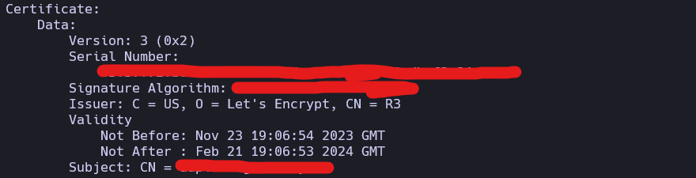

# documentation cerbot
- https://linuxhandbook.com/check-certificate-openssl/
- https://www.digitalocean.com/community/tutorials/how-to-secure-apache-with-let-s-encrypt-on-ubuntu-22-04

## Prérequis
- avoir un nom de domaine (exemple : example.com)
- avoir un serveur apache 
- Certificat let-s-encrypt (3 mois)

## Installation
- verifier statut apache :
    - sudo systemctl status apache2
- verifier que le service cron est bien actif :
    - sudo systemctl status cron
- verifier que le renew du cerbot fonctionne correctement :
    - sudo certbot renew --dry-run
(Si on arrive ici c'est que tout est ok)

sinon :
- si le certificat n'est plus valide :
    - regener le certificat :
        - sudo certbot --apache -d example.com -d www.example.com
        - sudo certbot renew
    - verifier la validité du certificat :
        - cd /etc/letsencrypt/live/[domaine]
        - openssl x509 -noout -dates -in cert.pem
        
    - verifier que le nom du certificat est bien le bon :
        - sudo nano /etc/apache2/sites-available/[domaine]-le-ssl.conf
        - SSLCertificateFile /etc/letsencrypt/live/[domaine]/fullchain.pem 
        - SSLCertificateKeyFile /etc/letsencrypt/live/[domaine]/privkey.pem
    - redemarrer apache :
    - sudo systemctl restart apache2
    - Aller dans un navigateur privé et vérifier que le certificat est bien valide
      - Attention, certain navigateur garde en mémoire les certificats

 Si vous êtes ici, c'est que vous avez reussi :)

